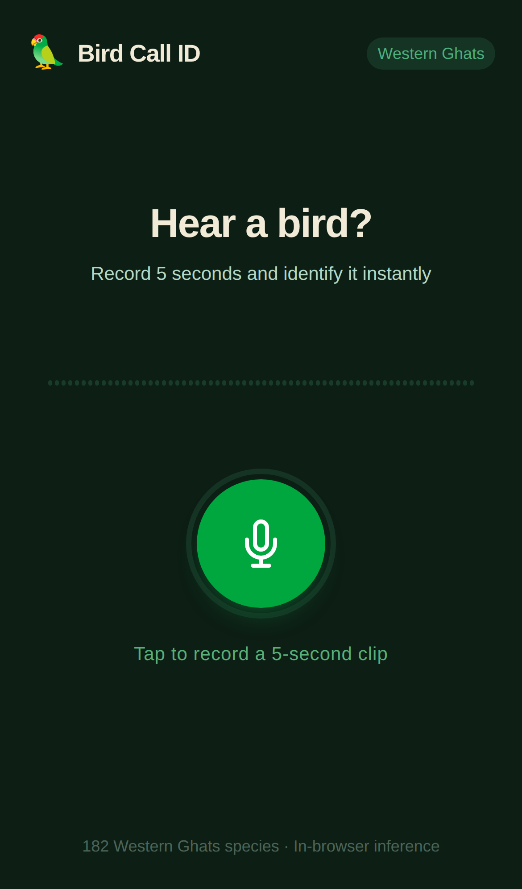
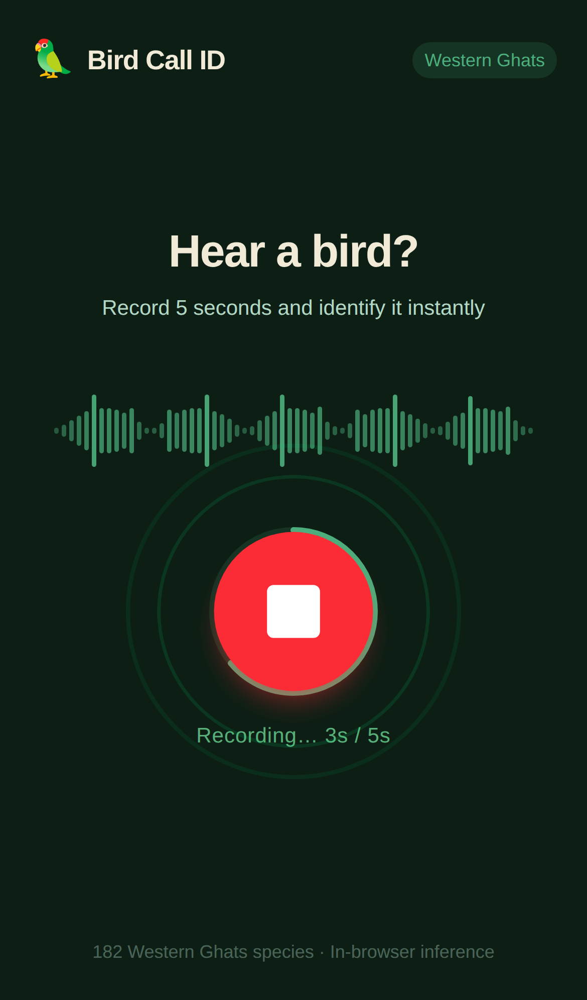
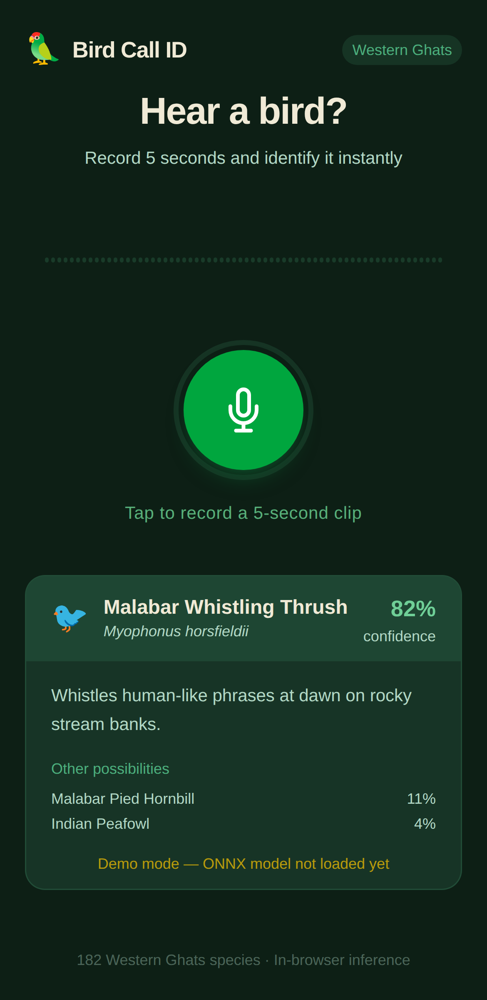

# Bird Call ID

Identify Western Ghats bird species from their calls — in the browser, offline, with no backend required during inference.

**One-line pitch:** hold up your phone, record 5 seconds of birdsong, and get a species prediction in seconds. Think *Shazam for birds*, but designed for low-connectivity field use.

**Current state:** the PWA, recording flow, browser-side mel spectrogram pipeline, and ONNX inference scaffolding are built. The repo still runs in demo mode until the trained BirdCLEF model is exported and dropped into `app/public/model/birdclef.onnx`.

**Live demo:** not published yet. Local demo mode works today; hosted demo comes after model export + parity validation.

---

## Why this is a strong portfolio project

Most BirdCLEF projects stop at a notebook. This one is explicitly about taking ML all the way to product shape:

- fine-tuned bird-audio classifier for **182 Western Ghats species**
- **browser-only inference path** via `onnxruntime-web`
- no backend dependency during prediction
- **PWA installable** on mobile for field use
- careful preprocessing parity work so browser inference matches training-time audio transforms

It shows the full stack of applied ML product work:
- dataset constraints
- audio preprocessing correctness
- model export / deployment trade-offs
- frontend UX for capture + inference
- offline-first delivery

---

## What works right now

### Product surface
- React + Vite PWA scaffold
- 5-second microphone recording flow in the browser
- waveform / recording UI
- result card UI for predictions
- installable PWA shell

### ML/inference plumbing
- pure-JS mel spectrogram pipeline
- centered reflect padding to better mirror `librosa` framing
- ONNX Runtime Web integration path
- mock/demo inference fallback when model assets are absent
- label-order validation script to keep training metadata aligned with inference labels

### DX / verification
- build passes
- lint passes
- demo wiring checks pass
- ONNX asset prep script is included

---

## Screenshots

Real screenshots from the current PWA running in demo mode.

<p align="center">
  
  
  
</p>

Left to right:
- idle hero screen
- active recording state with progress ring + waveform
- mock inference result card shown when model assets are not staged yet

---

## Architecture

```text
┌──────────────────────────────────────────────────────────────┐
│                      Browser / PWA                           │
│                                                              │
│  WebAudio capture → Mel spectrogram → ONNX Runtime Web       │
│  (32 kHz, 5 s)      (128 × 501, JS)  (EfficientNet-B0 ONNX)  │
│                                                              │
│  No backend call required during inference                   │
└──────────────────────────────────────────────────────────────┘
```

**Training stack:** PyTorch · torchaudio · Kaggle GPU  
**Dataset:** BirdCLEF 2024 — Western Ghats, 182 species, ~60k clips  
**App stack:** React · Vite · `onnxruntime-web` · `vite-plugin-pwa`

---

## Preprocessing contract

Browser inference is only trustworthy if preprocessing matches training exactly.

| Parameter | Value |
|---|---|
| Sample rate | 32000 Hz |
| Clip length | 5 seconds |
| `n_fft` | 1024 |
| `hop_length` | 320 |
| `n_mels` | 128 |
| `fmin` | 20 Hz |
| `fmax` | 16000 Hz |
| Output shape | `(128, 501)` float32 |
| Mel scale | Slaney (`htk=False`) |
| Normalization | power → dB, `top_db=80` |

Implementation location: `app/src/utils/melSpectrogram.js`

Until the real model is plugged in, treat this repo as **product scaffolding plus inference-contract work**, not a finished accuracy claim.

---

## Repo structure

```text
bird-call-id/
├── app/
│   ├── src/
│   │   ├── components/
│   │   │   ├── RecordButton.jsx
│   │   │   ├── ResultCard.jsx
│   │   │   └── WaveformVisualizer.jsx
│   │   ├── hooks/
│   │   │   ├── useAudioRecorder.js
│   │   │   └── useBirdInference.js
│   │   └── utils/
│   │       ├── birdData.js
│   │       ├── classLabels.js
│   │       ├── inferenceHelpers.js
│   │       └── melSpectrogram.js
│   ├── scripts/
│   │   ├── check-label-parity.mjs
│   │   ├── demo-check.mjs
│   │   └── prepare-onnx-assets.mjs
│   └── public/
├── DESIGN.md
├── TODOS.md
└── README.md
```

---

## Run locally

```bash
cd app
npm install
npm run dev
```

If `app/public/model/birdclef.onnx` is missing, the app intentionally falls back to demo predictions and returns to the ready state instead of hanging on loading.

### Verification commands

```bash
npm run build
npm run lint
npm run check:labels
npm run prepare:onnx
npm run demo:check
```

---

## Plug in the real model

Once training/export is done:

1. Copy `birdclef.onnx` to `app/public/model/birdclef.onnx`
2. Copy ONNX Runtime browser assets into `app/public/ort-wasm/`
3. Keep `app/src/utils/classLabels.js` aligned with training metadata
4. Validate ONNX vs PyTorch parity before trusting top-1 predictions

---

## Roadmap

### Phase 1 — model + hosted demo
- [ ] train EfficientNet-B0 on BirdCLEF 2024
- [ ] export checkpoint / artifacts
- [ ] push model to Hugging Face Hub
- [ ] deploy hosted demo
- [ ] validate public-val cmAP target

### Phase 2 — production-quality browser inference
- [x] PWA scaffold
- [x] microphone capture flow
- [x] pure-JS mel spectrogram implementation
- [x] ONNX Runtime Web hook-up
- [ ] export final ONNX model
- [ ] verify ONNX / PyTorch parity (>99% top-1 agreement on held-out checks)
- [ ] benchmark inference on a mid-range Android device
- [ ] deploy to Vercel or equivalent

---

## Dataset

[BirdCLEF 2024](https://www.kaggle.com/competitions/birdclef-2024) — Western Ghats of India, 182 species, roughly 60k training clips.

---

## Planned results section

To be filled in after training/export:

- validation cmAP
- ONNX model size
- browser inference latency
- mobile memory footprint
- qualitative field-test notes

---

## Good interview talking points

If you are using this repo in a portfolio, the strongest discussion angles are:

- why offline / browser-only inference matters for field use
- how easy it is to silently break audio-model accuracy with preprocessing drift
- why label-order parity matters in exported classifiers
- how to degrade gracefully when model assets are missing
- trade-offs between notebook accuracy and product reliability
